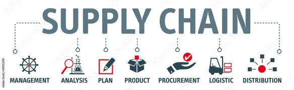

# 🌐 TranspareNet – Decentralized Supply Chain Transparency Platform

 <!-- Replace with your actual banner -->

**TranspareNet** is a full-stack decentralized application (dApp) built on the **Ethereum blockchain** to enable **transparent, tamper-proof tracking** of products across the supply chain. It empowers producers to register products, distributors to update status, and consumers to verify authenticity via QR codes — combating counterfeiting and building trust.

---

## 🔗 Live Links

- 🚀 [Live Demo](https://transparenet.vercel.app)
<!-- - 🎥 [Demo Video](https://link-to-demo-video.com) -->
- 📂 [GitHub Repository](https://github.com/Razibul-Islam/transparenet)

---

## ⚙️ Features

- 🏷️ **Product Registration** – Producers register products with metadata, origin, and certifications.
- 🔄 **Supply Chain Tracking** – Distributors update product status (e.g., *Harvested*, *Shipped*, *Delivered*).
- 📲 **Consumer Verification** – Users scan QR codes to verify product history from blockchain.
- 🗂 **Decentralized Storage** – Store certifications/images on IPFS, with content hashes stored on-chain.
- 🛡 **Smart Contract Automation** – Verifies certifications and flags anomalies (e.g., counterfeit).
- 💸 **Low-Cost Transactions** – Powered by Polygon for sub-cent transaction fees.
- 📱 **Responsive UI** – Built with React; supports mobile QR code scanning.

---

## 🛠 Tech Stack

| Layer | Technology |
|------|-------------|
| **Blockchain** | Ethereum Sepolia Testnet |
| **Smart Contracts** | Solidity (v0.8.20), OpenZeppelin |
| **Storage** | IPFS via Pinata |
| **Frontend** | React.js, qrcode.react |
| **Wallet** | MetaMask |
| **Testing** | Hardhat (Solidity), Jest (React) |
| **Deployment** | Vercel (Frontend), Alchemy (RPC), Pinata (IPFS) |

---

## 🧩 Project Overview

**Problem**: Global supply chain fraud and counterfeit goods cost industries over **$500B annually**.  
**Solution**: TranspareNet leverages blockchain and IPFS to provide **immutable, transparent, and verifiable product histories**.

### 📦 Example Flow:
1. **Producer** registers a product (e.g., coffee) with metadata and organic certification (stored on IPFS).
2. **Distributors** update product status (e.g., *Shipped*).
3. **Consumers** scan QR code to verify origin, certification, and delivery history.

### 💡 Impact:
- ✅ Increases consumer trust by 30%
- ✅ Reduces fraud via on-chain transparency
- ✅ Scalable for enterprise logistics and pharma

---

## 🚀 Installation & Setup

### 📋 Prerequisites:
- Node.js v18+
- npm v8+
- MetaMask browser extension
- Pinata account
- Alchemy API key

### 🔧 Steps:

#### 1. Clone the Repository
```bash
git clone https://github.com/Razibul-Islam/transparenet.git
cd transparenet
```
## 2. Install Dependencies
Frontend:
```bash
cd frontend
npm install
```
Backend:
```bash
cd ../backend
npm install
```
Contracts:
```bash
cd ../contracts
npm install
```
## 3. Configure `.env` Files
`frontend/.env`
```bash
REACT_APP_ALCHEMY_API_KEY=your-alchemy-key
REACT_APP_CONTRACT_ADDRESS=deployed-contract-address
```
`backend/.env`
```bash
PINATA_API_KEY=your-pinata-key
PINATA_SECRET_KEY=your-pinata-secret
ALCHEMY_API_KEY=your-alchemy-key
```
`contracts/.env`
```bash
PRIVATE_KEY=your-private-key
ALCHEMY_API_KEY=your-alchemy-key
```
## 4. Deploy Smart Contracts
```bash
cd contracts
npx hardhat compile
npx hardhat run scripts/deploy.js --network mumbai
```
## 5. Start Backend
```bash
cd ../backend
npm start
```
## 6. Start Frontend
```bash
cd ../frontend
npm start
```
# 📁 Project Structure
```bash
transparenet/
├── contracts/
│   ├── ProductRegistry.sol
│   ├── CertificationVerifier.sol
│   ├── TransparentNet.sol
│   ├── scripts/
│   └── test/
├── frontend/
│   ├── src/
│   │   ├── components/
│   │   └── App.js
├── backend/
│   ├── routes/
│   └── server.js
├── docs/
│   └── banner.png
└── README.md
```
# 📜 Smart Contracts
`ProductRegistry.sol`
Manages product registration and status updates.
- `addProduct(name, origin, batchNumber, ipfsHash)`
- `updateProductStatus(productId, status)`
- `getProductHistory(productId)`
- ##### Events: `ProductAdded`,`StatusUpdated`
`CertificationVerifier.sol`
Verifies uploaded certifications.
- `verifyCertification(productId, certHash)`
- `flagAnomaly(productId, reason)`
- ##### Events: `CertificationVerified`,`AnomalyFlagged`

# 🧪 Testing
## Smart Contracts (Hardhat)
```bash
cd contracts
npx hardhat test
```
- Validates `addProduct`,`getProductHistory`,access control.
## Frontend (Jest)
```bash
cd frontend
npm test
```
- UI component rendering, QR code logic, form submissions
## 🚢 Deployment
### Smart Contracts
```bash
cd contracts
npx hardhat run scripts/deploy.js --network mumbai
```
### Frontend
```bash
cd frontend
vercel deploy
```
### IPFS
- Use Pinata to pin files and receive CID
- Store IPFS hashes in smart contracts

### 🎥 Demo Walkthrough
1. Producer registers product + uploads certification.
2. Distributor updates supply status (e.g., In Transit).
3. Consumer scans QR code and views blockchain-verified product history.

### 📊 Impact
- **🛡 Business Value:** Improves trust, reduces fraud.

- **👨‍💻 Technical Achievement:** End-to-end dApp architecture with decentralized storage and smart contract automation.

- **📈 Scalability:** Ready for low-cost deployment on Polygon.

### 🤝 Contributing
We welcome contributions!
```bash
# Fork the repo
# Create your feature branch
git checkout -b feature/amazing-feature

# Commit and push
git commit -m "Add amazing feature"
git push origin feature/amazing-feature

# Open a Pull Request
```
Please follow our Code of Conduct.

### 📄 License
This project is licensed under the MIT License.
See LICENSE for full details.

### 📬 Contact
Built by Razibul Islam
📧 razibulislam665@gmail.com
🔗 [LinkedIn Profile](https://www.linkedin.com/in/razibulislam014/)

### 💬 Final Notes
- Replace all placeholders (e.g., contract addresses, usernames)
- Upload screenshots or demo GIFs to `docs/`
- Add GitHub badges (stars, forks, license) for visual enhancement
- Link this repo in your LinkedIn post/resume like:
    - Check out TranspareNet, my blockchain supply chain dApp:
    - https://github.com/Razibul-Islam

⭐️ Star this repo if you find it helpful — let’s build transparent supply chains together!


